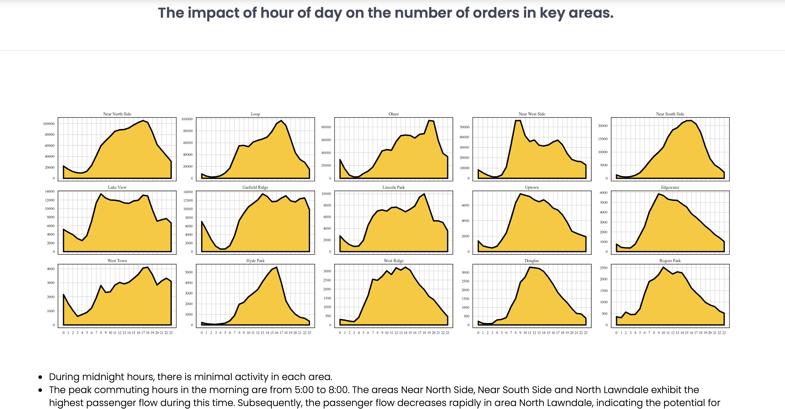

# Chicago Taxi Trip Analysis & Interactive Dashboards

  
*Figure: An interactive demonstration of the "Daily Trip Patterns and Peak Times" Dashboard.*


*Figure: An interactive demonstration of the "Hourly Long Trip Miles by Community Area" Dashboard.*


---

**Key Static Visualizations:**

  
  *Figure 1: Distribution of trip durations.*

  
  *Figure 2: Taxi trip counts by hour of day.*

  
  *Figure 3: Geographical heatmap of pickup locations.*

---

## Table of Contents

  1.  [Project Overview](#project-overview)
  2.  [Features](#features)
  3.  [Data Source](#data-source)
  4.  [Technologies Used](#technologies-used)
  5.  [Setup & Local Installation](#setup--local-installation)
  6.  [Usage](#usage)
  7.  [Live Demo](#live-demo)
  8.  [Analysis Highlights](#analysis-highlights)

---

## 1. Project Overview

  This project dives deep into **Chicago taxi trip data** from a massive Kaggle dataset. We've explored various aspects of taxi ride patterns, including geographical distribution of orders, trip durations, and distances. We're showcasing these insights through both static charts and two interactive Dash web applications. Our goal is to uncover trends and patterns that could be valuable for urban planning, transportation services, or passenger experience. For a quick look, **interactive dashboard demonstrations are included as video files, and key static visualizations provide a snapshot of the analysis.**

---

## 2. Features

  * **Comprehensive Data Analysis**: In-depth exploratory data analysis (EDA) on a large dataset of Chicago taxi trips.
  * **Static Visualizations**: Charts built with Matplotlib and Seaborn highlighting key findings like peak hours, trip distributions, and geographical patterns.
  * **Interactive Dashboards**: Two separate Dash applications for dynamic data exploration:
    * **`app.py` "Daily Trip Patterns and Peak Times"**: This app visualizes overall daily taxi trip activity, including trip counts, average speeds, or busiest hours across different days or months. It offers filters for specific date ranges or general time periods to pinpoint peak demand and quieter periods.
    * **`app2.py` "Hourly Long Trip Miles by Community Area"**: This dashboard lets you select a specific hour of the day using a slider. It then displays the top 14 community areas by their **long trip miles** for that selected hour, offering insights into long-distance travel patterns and highlighting areas with trips exceeding a 15 km threshold.
  * **Web Integration**: An `index.html` file combining static analysis charts with embedded interactive Dash applications for a unified project view.

---

## 3. Data Source

  The core of this analysis comes from the "Taxi Trips - 2023" dataset on Kaggle:

  * **Dataset Name**: Taxi Trips - 2023
  * **Source**: [Kaggle](https://www.kaggle.com/datasets/mexwell/taxi-trips-2023?select=Taxi_Trips_-_2023.csv)
  * **Original Size**: Approximately 1.56GB
  * **Note on Usage**: This project loads the entire dataset directly. Please ensure your system has **sufficient RAM** when running the applications locally to avoid performance issues or crashes.

---


## 4. Technologies Used

Here are the core technologies powering this project:

* **Python 3.x**: The primary programming language.  
* **Dash** ([Plotly Dash](https://dash.plotly.com/)): For building rich, interactive web applications directly in Python.  
* **Pandas**: Essential for efficient data manipulation and analysis, especially with large datasets.  
* **Plotly Express / Plotly Graph Objects**: Used for creating both static and dynamic, interactive visualizations within the dashboards.  
* **NumPy**: Provides fundamental support for numerical operations.  
* **Matplotlib**: Utilized for additional static plotting where needed.  
* **Seaborn**: A high-level library for drawing attractive statistical graphics.  
* **Geopandas**: (Include if your analysis specifically uses geospatial data beyond Plotly's built-in map capabilities).  
* **Calmap**: (Include if you generate calendar heatmaps).  
* **HTML, CSS**: For structuring and styling the main project display page.

---

## 5. Setup & Local Installation

Want to get this project running on your machine? Just follow these steps:

1. **Clone the Repository**:

   ```bash
   git clone [https://github.com/turingzhi/Web-dataAnalysis.git](https://github.com/turingzhi/Web-dataAnalysis.git)
   cd Web-dataAnalysis
   ```

2. **Create a Virtual Environment**:
   It's always a good idea to use a virtual environment to keep your project dependencies organized and separate from your system's Python packages.

   ```bash
   python3 -m venv dash_env
   ```

3. **Activate the Virtual Environment**:

   * **macOS/Linux**:

     ```bash
     source dash_env/bin/activate
     ```

   * **Windows**:

     ```bash
     .\dash_env\Scripts\activate
     ```

4. **Install Dependencies**:
   All the necessary Python libraries are listed in `requirements.txt`. Install them easily with:

   ```bash
   pip install -r requirements.txt
   ```

5. **Ensure Data is Present**:
   Make sure the large `Taxi_Trips_-_2023.csv` file (around 1.56GB) is located directly within your `Web-dataAnalysis` project directory, where this `README.md` file resides. The applications expect to find it there.

---

## 6. Usage

Once everything's set up, here's how to fire up your Dash applications and view the full project locally:

1. **Run the First Dash App (`app.py`)**:
   Open your terminal, ensure your `dash_env` virtual environment is active, and from the `Web-dataAnalysis` directory, run:

   ```bash
   python3 dash1/app.py
   ```

   This app will typically start a web server at `http://127.0.0.1:8050/`. Keep this terminal window open; closing it will stop the app.

2. **Run the Second Dash App (`app2.py`)**:
   Open a **new terminal window or tab**, activate your virtual environment in it, and again from the `Web-dataAnalysis` directory, run:

   ```bash
   python3 dash2/app2.py
   ```

   **Important:** Make sure `app2.py` is configured in its code to run on a **different port** (e.g., `app2.run(debug=True, port=8051)`) to avoid clashing with `app.py`. Keep this terminal window open as well.

3. **Open the HTML Display**:
   Navigate to the `index.html` file in your `Web-dataAnalysis` project directory using your web browser. You can often just drag and drop the `index.html` file into your browser, or right-click it and choose "Open with Browser". The iframes within `index.html` will then load your locally running, interactive Dash applications.

---

## 7. Live Demo

While a live public demo isn't currently available (due to the discontinuation of free hosting tiers for such applications), you can quickly see the interactive dashboards in action via these video demonstrations:

* **Dashboard 1 Demo**: [images/dash1.gif](images/dash1.gif)  
* **Dashboard 2 Demo**: [images/dash2.gif](images/dash2.gif)  
* **Full Webpage Demo**: [images/webpage.gif](images/webpage.gif)  

For the full interactive experience, we highly recommend following the [Setup & Local Installation](#6-setup--local-installation) and [Usage](#7-usage) instructions to run the applications directly on your own machine.

---

## 8. Analysis Highlights

* **Peak Travel Times**: Figure 2 clearly illustrates the surge in taxi trips during [morning/evening] rush hours, with a noticeable dip during [mid-day/late night].  
* **Trip Duration Distribution**: As seen in Figure 1, the majority of taxi trips are relatively short, with a long tail indicating a smaller number of significantly longer journeys.  
* **High-Demand Areas**: Figure 3 highlights specific community areas in Chicago that consistently show higher concentrations of taxi pickups, correlating with [commercial districts/residential hubs/etc.].
